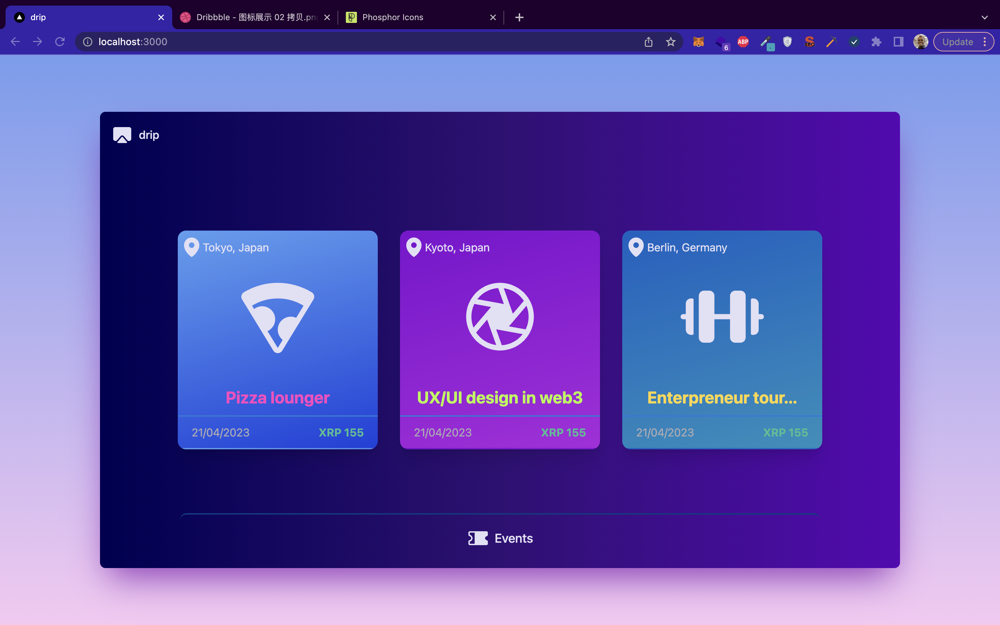

# Drip.xrp


Follow these instrtuction/configurations in order to test it on your own. This repository have frontend and the backend for showing how to setup the Drip wallet to buy ticket.

## Frontend and localhost are in the localhost

### Backend config:
The Backend has been developed by [@mile888](https://github.com/mile888), that is why we clone from his repository
```
git clone https://github.com/mile888/drip-backend
cd drip-backend
python web_app.py # it will be running on the port 5000
```

### Frontend config:
The Frontend has been developed by [@bm777](https://github.com/bm777), that is why we clone from his repository
```
git clone https://github.com/bm777/drip-frontend
cd drip-frontend
npm i
npm run dev # it will be running on the port 3000
```
Then open the this [link](http://localhost:3000) on the browser



To run the backend, you need Ngrok to allow incoming request from the web to connect the local instance